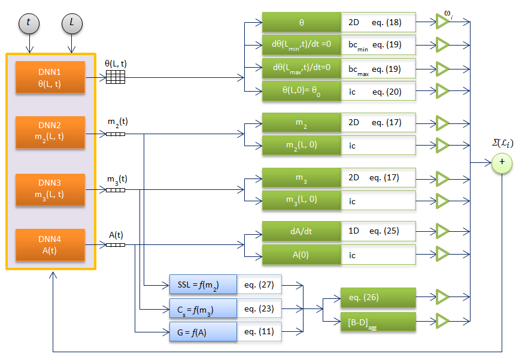

# PINN-PBE Model for Describing Gibbsite Bulk Crystallization Dynamics

[](https://python.org)
[](https://tensorflow.org)
[](LICENSE)

Physics-Informed Neural Network for solving Population Balance Equations (PBE) describing gibbsite bulk crystallization dynamics.

## Overview

The model addresses vulnerabilities in purely data-driven approaches by incorporating first-principle physics into neural network training. The system of population balance equations was transformed into a linearized form, generating a PINN-PBE model as a set of interconnected neural networks approximating the solution under batch conditions.

## Architecture

The model predicts four variables:
- `θ(L,t)` – logarithm of particle size distribution
- `m₂(L,t)` – second moment of distribution
- `m₃(L,t)` – third moment of distribution  
- `dA(t)/dt` – rate of change of alumina concentration

The loss function incorporates:
- Population balance equation (linearized form)
- Mass balance closure (solid phase volume fraction)
- Supersaturation dynamics
- Kinetic coefficients: growth, secondary nucleation



## Process Parameters

```python
# Domain
Th0         = 28.2417878478347    # Initial θ = ln(u)
Lmin, Lmax  = 0.001, 350.0        # Crystal size [μm]
tmax        = 48.0                # Batch time [hours]

# Physical properties
rho         = 2420.0              # Hydrate density [kg/m³]
Thnuc_f     = 12.0                # Nucleation rate

# Liquor composition (Head Tank)
Al2O3_in, Na2Oo, Na2Ok, TC = 120.0, 157.5, 140.0, 62.0

# Molar weights
MW_Al2O3, MW_AlOH3 = 0.102, 0.078    # [kg/mol]
```

## Clone repository
git clone https://github.com/vladimirgolubev2-ship-it/pinn-pbe.git
cd PINN-PBE

# Install dependencies
pip install -r requirements.txt

# Usage
bash
jupyter notebook pinn-pbe_4nets.ipynb

# Requirements

## GPU Version (default)
- NVIDIA GPU with CUDA support
- CUDA 11.2 + cuDNN 8.1
- TensorFlow 2.10.0 (GPU version)

## CPU Version (alternative)
For systems without NVIDIA GPU, modify the notebook:
```python
# Replace GPU imports/settings with:
import os
os.environ['CUDA_VISIBLE_DEVICES'] = '-1'  # Disable GPU

# Or install CPU-only TensorFlow:
# pip install tensorflow-cpu==2.10.0
```

# Citation
If you use this code in your research, please cite:
@article{Litvinova2026PINN,
  author    = {Litvinova, T.E. and Golubev, V.O. and Tuleshov, N.V.},
  title     = {PINN-PBE Model for Describing Gibbsite Crystallization Dynamics},
  journal   = {Metals},
  volume    = {16},
  number    = {8},
  pages     = {903},
  year      = {2026},
  doi       = {10.3390/met16080903},
  url       = {https://doi.org/10.3390/met16080903}
}
